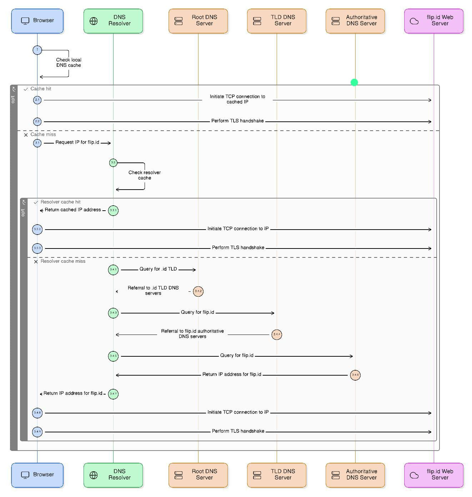
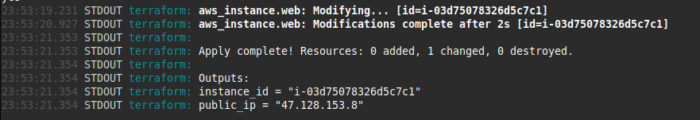
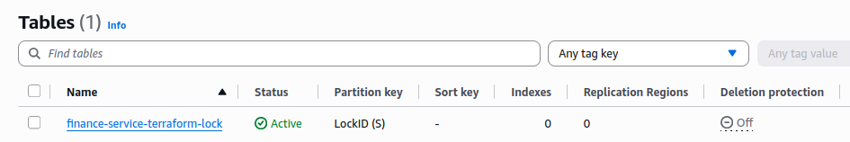
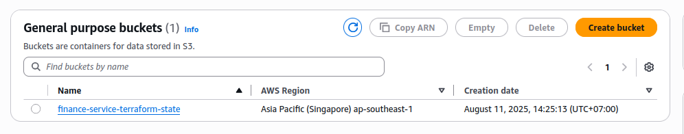
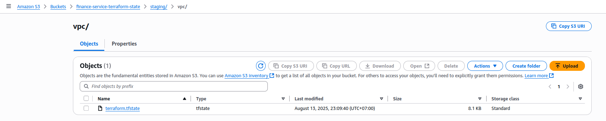
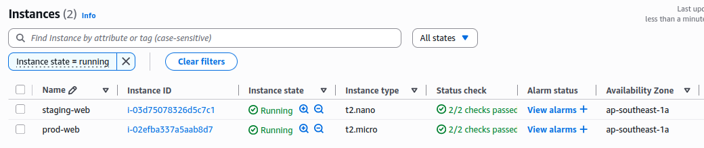
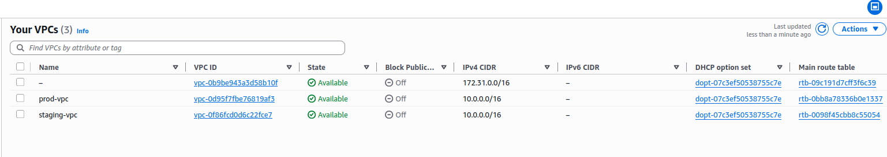

# TEST

Complete Documentation https://github.com/ghulammuzz/sre-F089348

## SECTION 1

### 1. What does an SRE do and how is it different from a SysAdmin?

**SRE (Site Reliability Engineer)**  

- Ensures systems are reliable, scalable, and efficient by applying software engineering principles to operations.  
- Focuses on automation, observability, capacity planning, and incident response.  
- Uses code & automation to manage systems.  
- Works with SLOs, SLIs, and Error Budgets.  
- Has a DevOps mindset, works closely with development teams.  

**SysAdmin (System Administrator)**  

- Focuses on day-to-day operations and manual system maintenance such as server configuration and patching.  
- Manual configuration and setup.  
- Mainly focuses on uptime.  
- Often separated from development.  

---

### 2. Define SLA, SLO, SLI, Error Budget

- **SLA (Service Level Agreement)** → Contractual agreement with the customer about service performance (e.g., 99.9% uptime).  
- **SLO (Service Level Objective)** → Internal performance target (e.g., 99.95% uptime).  
- **SLI (Service Level Indicator)** → Metric that measures service performance (e.g., percentage of successful requests in 30 days).  
- **Error Budget** → Maximum allowable downtime or errors before breaching the SLO.  

---

### 3. Uptime 99.9% per month

**a. Allowed downtime calculation:**  
30 days = 30 × 24 × 60 = 43,200 minutes
0.1% of 43,200 = 43.2 minutes downtime allowed per month


**b. Suggested monitoring & alerting:**  

- **Monitoring:** Prometheus/Grafana for metrics.  
- **Alerting:** Alertmanager → send alerts to Slack/Email/PagerDuty when latency or error rate exceeds thresholds.  
- **Synthetic checks:** Blackbox Exporter / UptimeRobot to verify availability from multiple locations.  
- **Logging:** Loki / ELK Stack for root cause investigation.  

---

## SECTION 2

### 1. How a DNS lookup works for `https://flip.id`


1. Browser checks local DNS cache.  
2. If not found, it queries a DNS resolver (ISP or public DNS like 8.8.8.8).  
3. The resolver checks its own cache; if not found, queries the root DNS servers.  
4. Root DNS servers return a referral to the `.id` TLD servers.  
5. `.id` servers return the authoritative nameservers for `flip.id`.  
6. The authoritative server returns the IP address to the resolver.  
7. The resolver sends the IP back to the browser.  
8. The browser initiates a TCP connection and performs a TLS handshake to the IP.  

---

### 2. Host 192.168.1.2/29 pinging 192.168.1.50/24

- **a.** Ping will fail.  
- **b. Reasoning:**  
        - 192.168.1.2/29 → subnet range: `192.168.1.0 – 192.168.1.7`  
        - 192.168.1.50/24 → subnet range: `192.168.1.0 – 192.168.1.255`  

From the /29 host’s perspective, 192.168.1.50 is outside its subnet and requires a gateway/router. If no gateway is configured, communication will fail.  

---

## SECTION 3

### 1. Troubleshooting with the OSI model

- **Layer 1 (Physical):** Check cables, power, network interface card.  
- **Layer 2 (Data Link):** Check switch connection, VLAN settings.  
- **Layer 3 (Network):** Verify IP, subnet, gateway, and ping tests.  
- **Layer 4 (Transport):** Test connectivity using `telnet` or `netcat` to target port.  
- **Layer 5 (Session):** Check for session timeouts or keepalive settings.  
- **Layer 6 (Presentation):** Verify SSL/TLS certificates.  
- **Layer 7 (Application):** Check application logs, configurations, and authentication.  

---

### 2. GCP choice for a simple web application

- **Answer:** **B. Cloud Run** → Ideal for running containerized apps without managing infrastructure, with automatic scaling -> simple.  
- **When to choose differently:**  
      - **GKE** → For complex, multi-service workloads.  
      - **Compute Engine** → For full VM control.  
      - **App Engine** → For a PaaS option with more opinionated runtime.  

---

### 3. High memory usage alert

- **Answer:** **B.** Check logs and metrics to determine if there’s a memory leak or unusual load pattern.  
- **Reasoning:** Increasing memory or restarting is only a temporary fix. Disabling alerts can hide real issues.  
- **Verification:** Use tools like `top`, `htop`, `kubectl top pod`, and Prometheus metrics to identify the root cause.  

---

## SECTION 4

### 1. What is IaC and why is it important?

**Infrastructure as Code (IaC)** → Defining infrastructure in configuration files that can be executed automatically.  

**Importance:**  

- Consistent environments.  
- Version-controlled infrastructure.  
- Faster provisioning.  
- Easier rollback and reproducibility.  

**Difference from manual provisioning:** No manual clicks or step-by-step configuration; everything is automated and repeatable.  

---

### 2. Basic Terraform Config (EC2 provision with tagging for cost observ)  

for here I use and utilize terragrunt as ec2 because the answer is the same as no. 4.4 and 4.3

```bash
2.4
├── modules
│   ├── ec2_asg
│   │   ├── data.tf
│   │   ├── main.tf
│   │   ├── outputs.tf
│   │   └── variables.tf
│   └── vpc
│       ├── main.tf
│       ├── outputs.tf
│       └── variables.tf
├── output-public-ip.png
├── terragrunt-insance-example.png
└── terragrunt-vpc-example.png
```

e.g public_ip as a output




### 3. Safely applying Terraform changes in collaboration

When working with multiple team members, it’s important to ensure Terraform deployments are **safe**, **predictable**, and **free from state conflicts**. Here are the recommended practices:

---

#### 1. Use Remote State Storage
- Store the Terraform state file in a **remote backend** such as **Amazon S3**, **Google Cloud Storage (GCS)**, or **Terraform Cloud**.
- This ensures all team members work with the **same up-to-date state** instead of maintaining local copies.

---

#### 2. Enable State Locking
- Use a **locking mechanism** to prevent concurrent modifications:
  - **DynamoDB** (when using S3 backend)
  - **Terraform Cloud’s built-in locking**
- This avoids **state corruption** caused by two people applying changes at the same time.

---

#### 3. Run `terraform plan` Before Applying
- Always run:
  ```bash
  terraform plan
  ```
- Review the plan to see what changes will be made.
- Share this plan for peer review before running:
  ```bash
  terraform apply
  ```

#### 4. Consisten Provider and Module Versions
  - lock provider using req_provider
  ```terraform
      terraform {
            required_providers {
                  aws = {
                        source  = "hashicorp/aws"
                        version = "~> 5.0"
                  }
            }
      }
  ```
  - lock module using versions in `source` ref
  ```
      module "vpc" {
            source  = "git::https://github.com/example/vpc.git?ref=v1.2.0"
            }

  ``` 

#### 5. Automate with CI/CD Pipelines

- Implement automated workflows with GitHub Actions, GitLab CI, or similar.

- CI/CD pipeline should:

  - Run terraform fmt to format code
  - Run terraform validate to check syntax and provider configs
  - Generate a plan for review using -tfout to show in pr comment
  - Apply changes only in a controlled environment can via merge trigeer or via tools like `atlantis` to apply in comment review


```
└── prereq
    ├── dynamodb-lock-tf.png
    ├── main.tf
    └── terraform.tfstate
```

[Directory](https://github.com/ghulammuzz/sre-F089348/tree/main/section-4/3/prereq)

e.g table for lock


e.g s3 for save tfstate



e.g s3 dir for tfstate


### 4. Terraform structure for staging and production 

To create identical infrastructure for staging and production with only minor differences (like instance type or number of replicas), I structure the codebase using Terragrunt and reusable Terraform modules. in this case im only changed to configure `instance_type`

```bash
2.4
├── live
│   ├── production
│   │   ├── ec2_asg
│   │   │   └── terragrunt.hcl
│   │   └── vpc
│   │       └── terragrunt.hcl
│   ├── root.hcl
│   └── staging
│       ├── ec2_asg
│       │   └── terragrunt.hcl
│       └── vpc
│           └── terragrunt.hcl
├── modules
│   ├── ec2_asg
│   │   ├── data.tf
│   │   ├── main.tf
│   │   ├── outputs.tf
│   │   └── variables.tf
│   └── vpc
│       ├── main.tf
│       ├── outputs.tf
│       └── variables.tf
├── output-public-ip.png
├── terragrunt-insance-example.png
└── terragrunt-vpc-example.png
```
#### Environment-Specific Inputs

Each environment passes its own variables to the same modules:
Staging (live/staging/ec2_asg/terragrunt.hcl)
```
inputs = {
  aws_region     = "ap-southeast-1"
  instance_type  = "t2.nano" <---
  subnet_id      = dependency.vpc.outputs.public_subnet_id
  env            = "staging"
  project        = "finance-service"
  cost_center    = "FIN001-FinancePlatform"
}
```
Production (live/production/ec2_asg/terragrunt.hcl)
```
inputs = {
  aws_region     = "ap-southeast-1"
  instance_type  = "t2.micro" <----
  subnet_id      = dependency.vpc.outputs.public_subnet_id
  env            = "production"
  project        = "finance-service"
  cost_center    = "FIN001-FinancePlatform"
}
```
Only minor differences, like instance_type and env, are changed per environment. Everything else is reused from the same Terraform modules.




